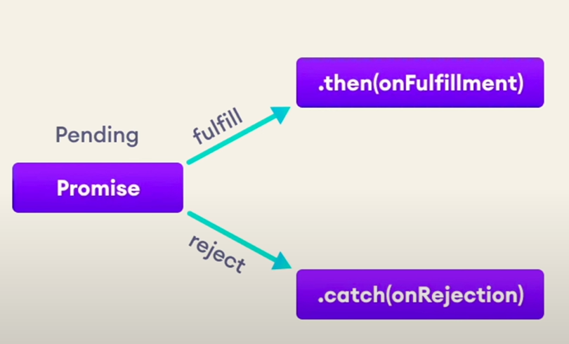
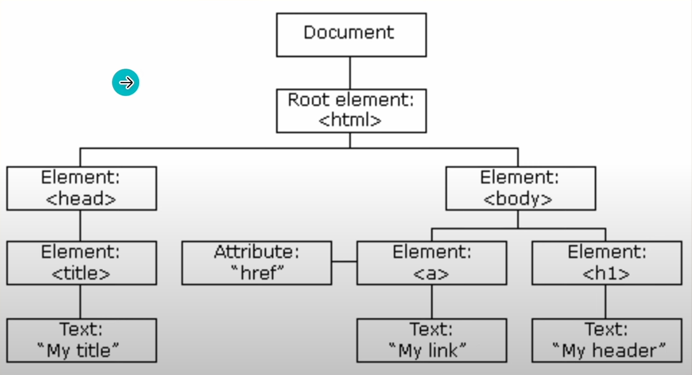

### Important Notes :
Java Script is a scripting language that enables you to create dynamically uploaded content, control multimedia, animate images. JS engine takes the code and pass into the parser for syntax checking. Then, if code is alright, converted into AST(Abstract Syntax Tree) which takes the programs as bunch of node. Then converted to machine code, finally, code runs. *Variable* are declared using ` let, const, var `, let is used for block-scope variable & const is used for constants. JS engine applies semi-colon automatically at the runtime.


*Data types* are basically which type of variable it is. Different types are ` String, Number, Boolean, Object, Undefined, NaN, Null `. `typeof(variable_name)` prints the type. Cons of JS is that it is not type safe. Logical operations are written as ` && (and) `, ` || (or) ` and ` ! (not) `. Output is printed using ` console.log("Hi !") `. *Ternary operation* is written as ` condition ? passed : failed `. *Switch case* used to avoid nesting. *Loops are of type for, while, do while*.

```js
switch(connectionUrl) {
    case "localhost:5050/?super_user=true":
        console.log("You are being redirected to super user console");
        break;

    case "localhost:5050/?admin=true":
        console.log("You are being redirected to admin console");
        break;

    case "localhost:5050/?member=true":
    case "localhost:5050/?user=true":
        console.log("You are being redirected to our website");
        break;

    default:
        console.log("Bad request ERROR 404");
}

for(let i=0; i <= arr.length; i++) --> for loop prototype
while(i <= arr.length) { i++; } --> while loop prototype
do {} while(condition_check) --> do while loop prototype; atleast one time runs
```
**Arrays** is an object which can store multiple values at once. ` const arr = ['hi', 'hello', 'greet'] `. Methods of arrays are *indexOf(), includes(), push(at_the_end), unshift(at_the_first), pop(from_the_end), shift(from_the_start), sort(reverse=false), slice(create_an_subarray)*. **Functions** are the block of code used to execute business logic on demand. When we store the return type of any function into a variable. In case of nested functions, the nested (inner) function is private to the containing (outer) function. Arrow function eliminates function keyword, function_name & presents arrow before braces, was introduced in ES6 version of JS.

```js
// Normal function declaration
function sum(first_operand, second_operand) { 
    const result = first_operand + second_operand;
    console.log("The operands result is ", result);
    return result;
}
```

**Call back function** is when a function is passed as an argument to another function. Some examples are .find(function_condition, collection_array) returns first occurence of condition; .findIndex(function_condition, collection_array); .forEach(function_to_apply) applies function for each element in the array. **Asynchronous** code is basically running parallely, setTimeout(function, milliseconds);  ***Promises*** are used to avoid callback hell. *Then method* used when promise is resolved, *Catch method* when promise is rejected or error occurred, *Finally method* will always run.



```js
/* using async & await */
async function orderPizza() {
    try {
        const cheese = await getCheese();
        console.log("Here is your cheese.");
        const dough = await getDough();
        console.log("Here is your dough.");
        const pizza = await getPizza();
        console.log("Here is your pizza.");
    } catch(err) {
        console.log("Error occurred : ", err);
    }
}

orderPizza();
```

**Dom Manipulation** known as Document Object Model. Document is the parent element at the start of the DOM tree. There are the following ways to access the document object in web structure: *Finding the HTML Elements* by id, tag_name, class_name, css_selectors. When there are more than one element returned, *HTML Collection* is returned which is very similar to array-like structure. *Modifying HTML Elements* by innerHTML. Always select an element by id, because it is unique for every element.

```js
// finding the different elements
const box1 = document.getElementById('box-1');
const boxs = document.getElementsByClassName('box-card');
const divs = document.getElementsByTagName('div');
const random = document.querySelectorAll('.container .box-card') // returns a node list

// modifying styles & inner HTML
box1.innerHTML = "BOX A"; 
box1.style.backgroundColor = "blue";

// manipulating class list
box1.classList.add('round-border');
box1.classList.remove('round-border');

// creating a new element
const newP = document.createElement('p');
newP.innerHTML = "Hi ! This is changing."
const container = document.getElementById('container');
container.appendChild(newP);

```


**DOM Events** allows you to write JS code that reacts to certain situations. Like mouse clicking, web page loading, a form field changed. There are mainly two way to interact: *using event handler & event listener*. Event handler are as follows: onclick(), onload(), onmouseover(), onmouseout(), onkeypress(), onkeydown(), onkeyup() -- ` onclick=functionName() `. In case of Event Listener, we need to define everything in javascript, starting by selecting the object, ` addEventListener('event_name', callback_function, capture_behaviour) ` function is being used over the object. Multiple events can be triggered over same object. *Bubbling* happens when innermost children takes listener & *Capture* happens when outermost children takes event listener.

```js
/* Event Listener - event parameter contains all the information related to the event */
const box2 = document.getElementById('box-2');
box2.addEventListener('click', (event) => {
    console.log("Box 2 was clicked : ", event);
});
```